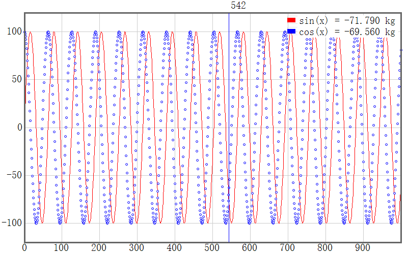
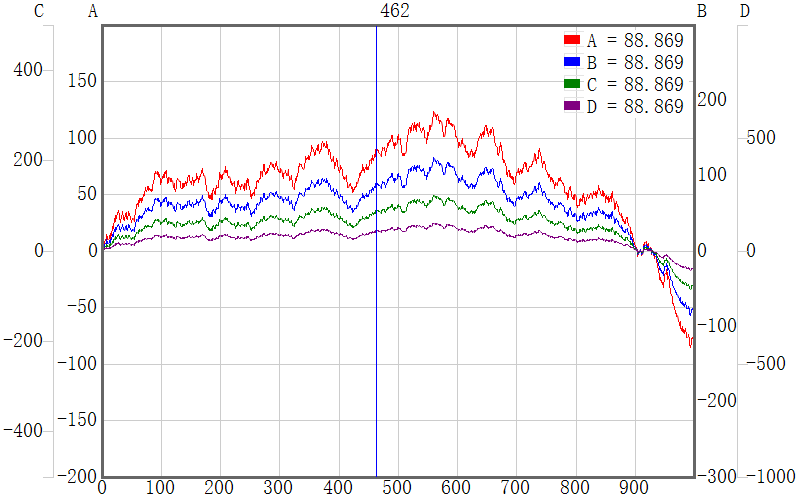
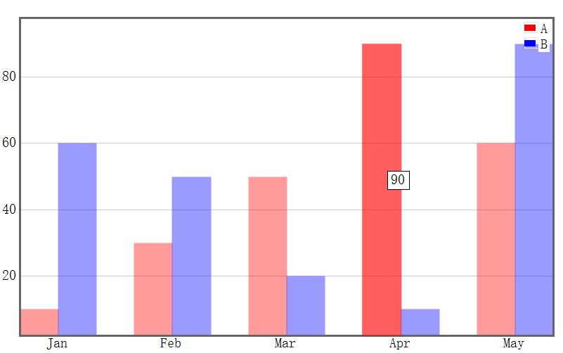
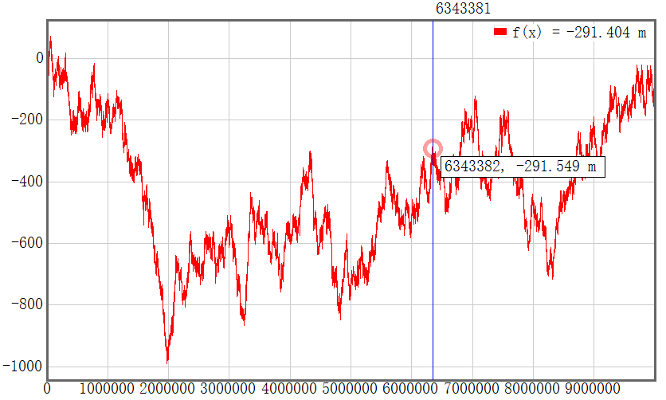
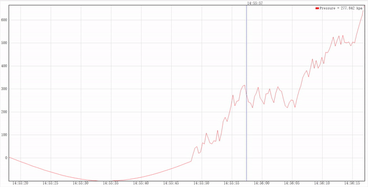

# Csharpchart

Chart for winform application. Features:
- Chart types: line chart, discrete point chart, bar chart
- Support pan and zoom
- Datetime x axis
- Real time updating chart data
- Fast speed
- Small code size, no dependency 

## Install

Copy the files under "Chart" directory.

## Usage

See Form1.cs for demo code.

Line and point chart:  

Multiple Y axes:  

Bar chart:  

Big data:  

Date axis and realtime data:  

